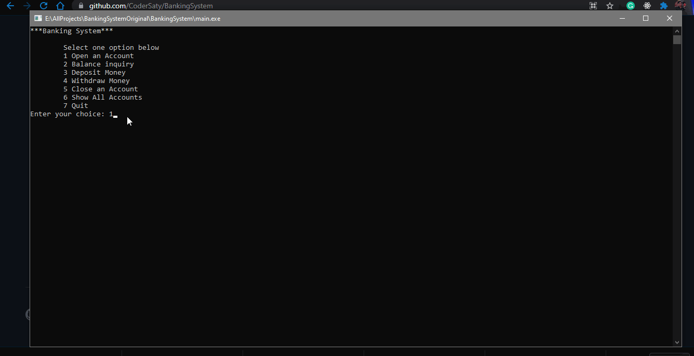

<h1 align="center" id="top">Welcome to Banking System 👋</h1>

# Basic Overview

> This project is a console based application developed in c++ to build a banking system and implement all the basic operation of bank as well as store data using file system.
 

# Table of Contents

- [Description](#description)
- [Technologies Used](#technologies)
- [How to use](#How-to-use)
- [Features](#features)
- [References](#references)
- [License](#license)
- [Support](#support)
- [Author Info](#author-info)

 

# Description

A console based application devleoped using c++ to depict a banking system. It performs all the basic operation of a bank like 

- opening a bank account
- withdrawing money from an account
- depositing money in an account
- closing an account.
- view details of all account.
- Balance enquiry for any account by account number.

 

# Technologies

- [C++](https://en.wikipedia.org/wiki/C%2B%2B)
- [Git](https://en.wikipedia.org/wiki/Git)
- [Markdown](https://en.wikipedia.org/wiki/Markdown)

### Tools used

- [VS Code](https://en.wikipedia.org/wiki/Visual_Studio_Code)
- [Github](https://en.wikipedia.org/wiki/GitHub)

 

# How to Use

> Simply clone or downlaod the repo in your local system and run the .cpp file using any c++ compiler and follow the instruction given on the console to use this application smoothly.
# Features

- It follows all the principle of the object oriented programming.
- It stores the date in file and it keeps the data even after closing the application.

# References

I have used the following resources in creation of this project:

- [Learn C++ Programming -Beginner to Advance- Deep Dive in C++](https://www.udemy.com/course/cpp-deep-dive/)

 

# License

[MIT License](LICENSE.md)

Copyright (c) 2021 @[codersaty](http://codersaty.github.io/Portfolio)

 

# Support

In case of any problem/ query, feel free to do pull requests or contact the author.

If anyone is intrested you can do the pull request for adding the following features:

- Update details(mobile, email etc) of the account holder after creating the account.
- Transfer the money from one account to other if both the accounts exists in the bank.
- Give the option for type of account (saving , fd, loan etc) and ask for details according to that. 
- Create a FD intrest calculator as additional feature of this application where the user has to answer the intrest rate and time period and it will give the total amount after that period.
- Do the same thing for the loan intrest calculator and so on.

 

# Author Info

- Twitter - [@codersaty](https://twitter.com/codersaty)
- Website - [Anuranjan Srivastava](http://codersaty.github.io/Portfolio)
- Linkedin - [codersaty](https://www.linkedin.com/in/codersaty)

 

[Back To The Top](#top)

